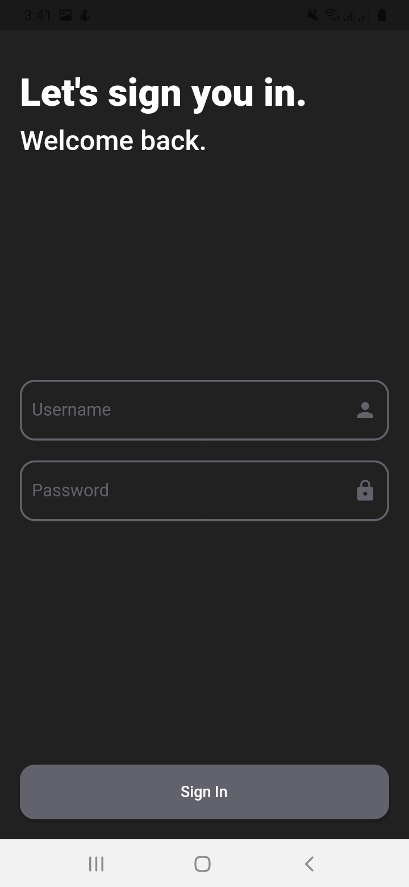
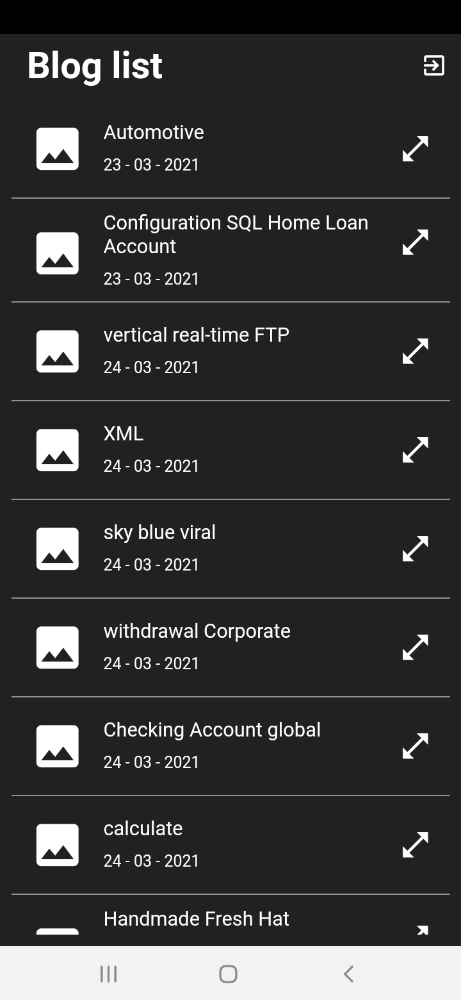
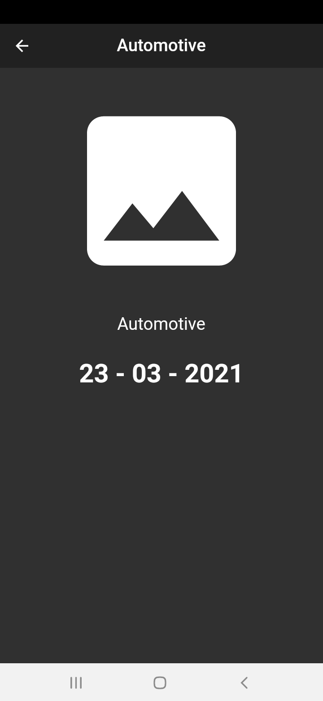

# 🔥🔥 Flutter Traveler's Social App  
Flutter Blog App

<a href="apk/app.apk"></img></a>
## ✨ Libraries & Techs used
* Provider (state management)
* MVVM Architecture 
* Shared Preferences
* get_it (dependency injection)
* data_connection_checker
* cached_network_image
* http

## 📸 ScreenShots

  

## 🤓 Author(s)
**Femi Bolaji** 

